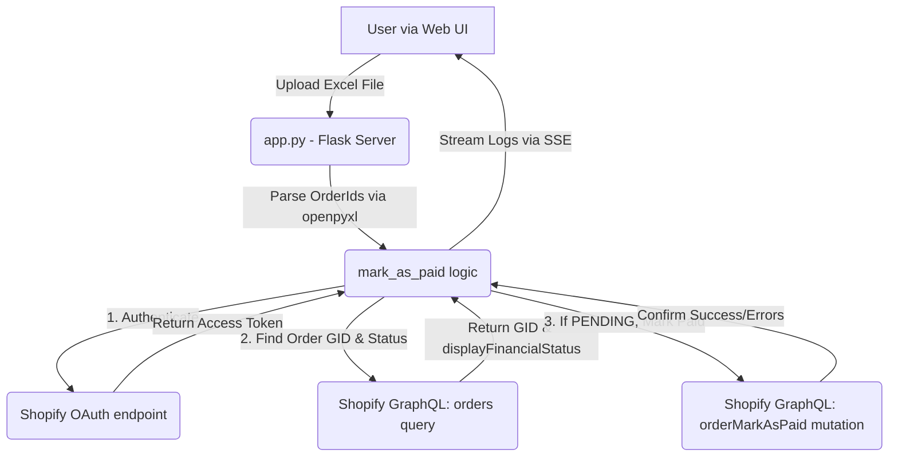

# AGENTS.md

Welcome to the Shopify COD Order Mark as Paid Automation repository. This document serves as the entry point and contract for all AI agents working on this codebase.

## Project Overview & Core Mission
A lightweight, Python-based web application and CLI tool to automate marking Cash-on-Delivery (COD) orders as Paid in Shopify. It provides a web interface where users can upload logistics Excel sheets, process them, and view real-time logs via SSE as their payment status is updated via the Shopify GraphQL Admin API.

- **Backend Runtime:** Python 3.10+
- **Primary Dependencies:** `Flask`, `requests`, `python-dotenv`, `openpyxl`
- **Integrations:** Shopify Admin GraphQL API

## Architecture Diagram & Flow



## Repository Conventions & Coding Standards
- **Python Style:** Follow PEP 8 guidelines. Use clean snake_case for functions and variables. UPPER_CASE for global constants.
- **Dependency Management:** Packages should be listed in instructions/dependencies. Use a virtual environment.
- **Error Handling:** Always check for `userErrors` returned in GraphQL payloads, not just HTTP status codes.
- **Environment Variables:** All secrets and configurations (`SHOPIFY_SHOP`, `SHOPIFY_CLIENT_ID`, `SHOPIFY_CLIENT_SECRET`) must be kept in `.env` and never committed.

## Project Structure Tree
```
.
├── .env                  # Shopify store credentials (ignored by git)
├── .gitignore            # Git ignore file
├── README.md             # Public project description and user guide
├── app.py                # Main Flask application and API endpoints
├── find_order.py         # Debug utility to look up order info by number
├── mark_as_paid.py       # Main automation script (Excel parser + Shopify caller)
├── test_shopify.py       # Authentication validation script
├── templates/            # HTML templates for the Web UI
│   └── index.html        # Main dashboard interface
├── orders/               # Legacy input directory for Excel invoice files
└── docs/                 # Project documentation suite
```

## Workflows
- **Running the Web App:** `python app.py` (access at `http://localhost:8080`)
- **Running a single order test (CLI):** `python mark_as_paid.py --order <number>`
- **Running a single file test (CLI):** `python mark_as_paid.py --file "orders/<filename>.xlsx"`

## AI Directives
1. **Analyze First:** Before modifying any GraphQL query or mutation, verify the schema version in use (default is `2026-04`).
2. **GraphQL Safety:** Always include the `userErrors` field in mutations to properly detect business logic errors (e.g., trying to pay an archived order).
3. **Paths:** Use relative repository paths when referencing files, never absolute paths.

## Definition of Done
1. Implementation is clean and adheres to PEP 8.
2. Code runs successfully without unhandled exceptions.
3. Documentation is updated according to the mapping below.

## Documentation Update Mapping

| Trigger Event | Target Files to Update |
| :--- | :--- |
| New feature added | `docs/FEATURES.md`, `docs/CHANGELOG.md`, `docs/OVERVIEW.md` (if scope changes) |
| API route / webhook changed | `docs/API.md`, `docs/WORKFLOWS.md` |
| Database migration added/edited | `docs/DATABASE.md` |
| Architecture / system design changed | `docs/ARCHITECTURE.md`, `docs/WORKFLOWS.md`, `AGENTS.md` |
| Frontend component added/edited | `docs/COMPONENTS.md` |
| Deployment / serverless config changed | `docs/DEPLOYMENT.md`, `docs/PROJECT.md` |
| Bug fixed | `docs/CHANGELOG.md`, `docs/TROUBLESHOOTING.md` |
