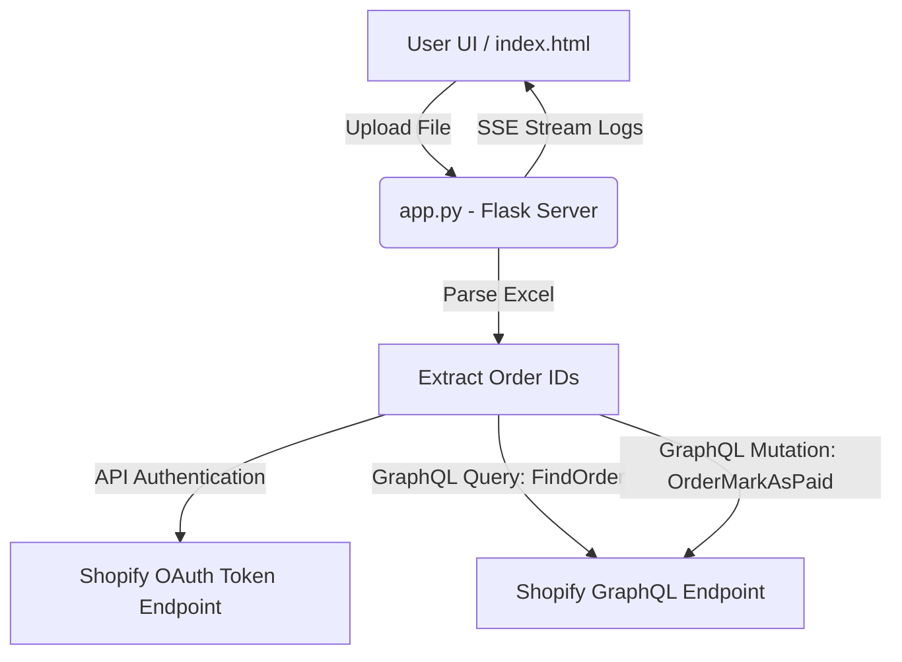

# System Architecture

## Architecture Diagram

## Lifecycle Flow
1. **Startup:** `load_dotenv` initializes environment variables and Flask server starts.
2. **File Upload:** User uploads Excel files via the Web UI (`/api/upload`). `app.py` parses them for `OrderId` column and deduplicates order numbers into a session.
3. **Execution Request:** User clicks Process, initiating a POST to `/api/process` which starts a background thread.
4. **Execution Loop (Background Thread):**
   - Obtains a temporary OAuth access token from Shopify's OAuth endpoint.
   - Iterates through the deduplicated Order IDs.
   - Query Shopify to retrieve order GID and financial status.
   - If not found: report as `not_found`.
   - If status is `PAID`: report as `already_paid` and skip.
   - If status is not `PAID`: invoke `orderMarkAsPaid` mutation.
   - If user errors return: report as `error` and print message.
   - If success: report as `success`.
5. **Real-time Streaming:** Throughout the execution loop, logs and summary metrics are streamed back to the UI via Server-Sent Events (SSE) at `/api/stream/<session_id>`.

## Error Resilience
- **Invalid Tokens / Unauthorized:** Script immediately calls `raise_for_status()` to abort execution if authentication fails, preventing silent failure.
- **User Errors Handling:** User errors in Shopify (e.g. order is archived) are parsed from the GraphQL response structure and output directly instead of crashing.
- **File Parsing Safety:** Openpyxl workbooks are closed in a `finally` block or explicitly after iteration to prevent memory leaks and file locks.
