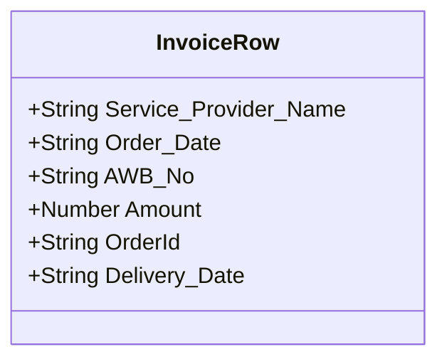

# Data Models & Schemas

## Database Schema
This project is a stateless command-line script and **does not maintain an active database or store any persistent data locally**.

## State Machine / Local Data Representation
The script operates temporarily in-memory with the following data shapes extracted from external Excel files:

Only the `OrderId` column is extracted and stored in-memory as a list of strings for processing:
`["1001", "1002", "1003", ...]`
All persistent state is managed entirely by Shopify upstream.
