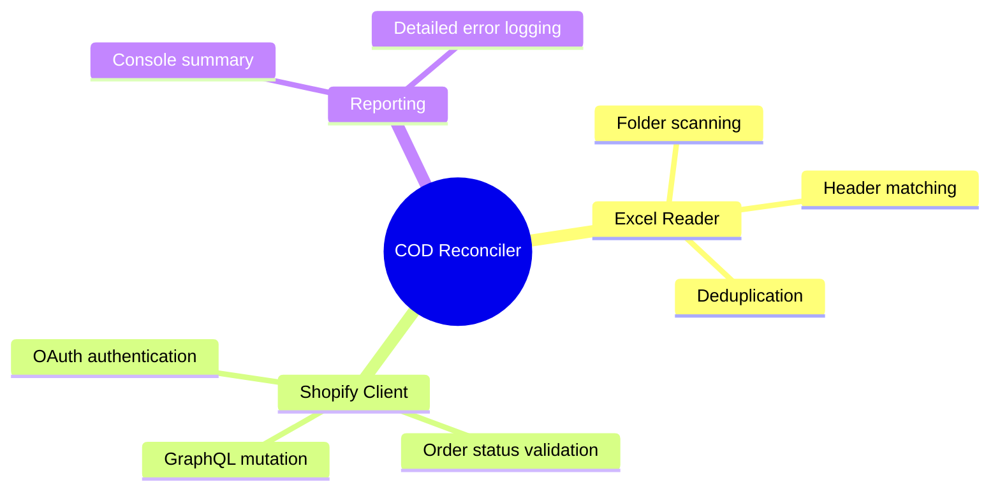

# Business & Product Overview

## 1. Project Title
Shopify Cash-on-Delivery (COD) Order Mark as Paid Automation

## 2. Executive Summary
This automation script eliminates manual data-entry overhead for merchants processing COD orders. By parsing delivery invoice spreadsheets exported from shipping providers and automatically matching and marking those orders as paid via Shopify's Admin API, it turns a hours-long daily manual reconciliation task into a 1-minute command execution.

## 3. Business Problem
COD orders in Shopify remain in a "Payment Pending" state when shipped. Once the carrier delivers the package and collects cash, they send the merchant an invoice/manifest spreadsheet containing the delivered orders. Merchants must manually search and mark each order as paid in Shopify, leading to delays, high labor costs, and data-entry errors.

## 4. Business Objectives
- Reduce time spent on order reconciliation by 95%+.
- Eliminate human entry errors in marking orders as paid.
- Enable same-day payment status updates in Shopify.

## 5. Business Value
- Decreases administrative labor costs.
- Speeds up cash-flow tracking by keeping Shopify financial records in sync with actual bank/carrier payouts.

## 6. Business Impact
- Scalability: Handles hundreds of orders instantly.
- Accuracy: Safeguards against accidentally marking wrong orders as paid.

## 7. Target Users
| Role | Context | Primary Touchpoint |
|---|---|---|
| E-commerce Operations Manager / Reconciler | Reconciles logistics invoices against Shopify store status daily or weekly | Runs CLI script / drops invoice files in `orders/` |

## 8. Stakeholders
- E-commerce merchants
- Finance and accounting teams
- Shipping / Logistics partners

## 9. Functional Scope
- Reads and parses all `.xlsx` invoice sheets in a designated folder.
- Extracts unique Shopify order IDs based on a customizable header name.
- Authenticates securely with Shopify using OAuth.
- Queries order info to verify current status.
- Programmatically updates status to Paid for eligible orders.

## 10. Out-of-Scope Functionality
- Direct bank account integration.
- Auto-downloading invoices from email or carrier portals.
- Handling partial payments or refunds.

## 11. Product Vision
To be a fully automated background service that integrates with common carrier portals via APIs or email scrapers to reconcile payment statuses automatically.

## 12. Key Features

## 13. Competitive Advantages
- Zero external SaaS fees; runs completely locally and securely.
- Dynamic Excel header matching.
- Extremely lightweight with minimum dependencies.

## 14. High-Level Architecture Overview

## 15. External Integrations
- Shopify GraphQL Admin API

## 16. Security Overview
- Credentials stored locally in `.env` (excluded from version control).
- Communicates exclusively over HTTPS using SSL.
- Requires limited API permissions (`read_orders`, `write_orders`).

## 17. Performance Strategy
- In-memory deduplication of order numbers prior to making API calls to minimize API request volume.
- Fast sequential request loop utilizing GraphQL queries.

## 18. Risks and Assumptions
- Assumes logistics providers maintain a consistent column containing the Shopify Order Number.
- Rate limits on the Shopify API might throttle extremely large batches.

## 19. Success Metrics
- 100% accuracy in updating statuses.
- Batch processing speed < 1.5 seconds per order.

## 20. Future Roadmap
- Requires Product Owner Input.

## 21. Glossary
- **COD**: Cash on Delivery.
- **GID**: Global ID (Shopify's internal identifier format, e.g., `gid://shopify/Order/123456`).
- **OAuth**: Open Authorization protocol used to authenticate secure API connections.
