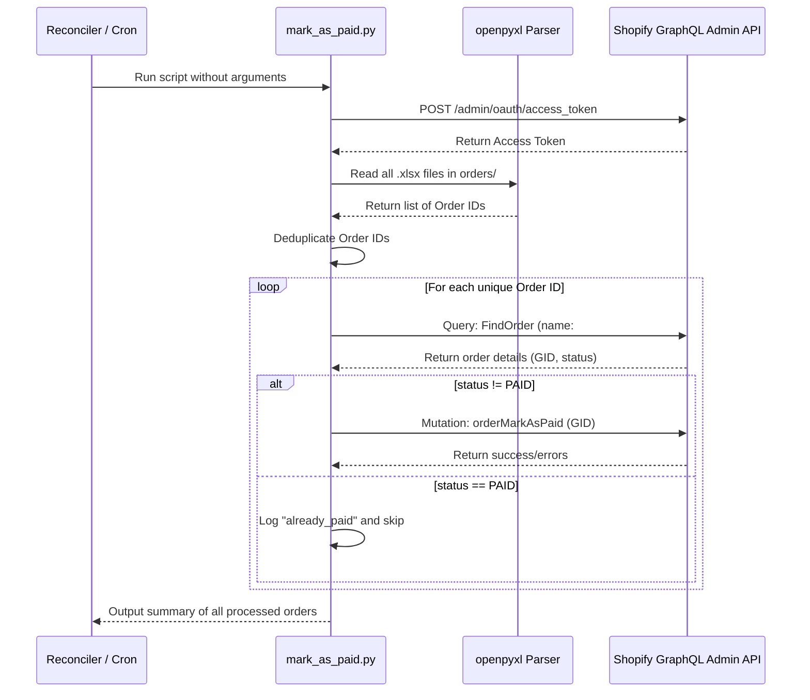

# Sequence Workflows

## Batch Processing Workflow

The following sequence diagram illustrates the workflow when running the main script to process all Excel invoice files.

```mermaid
sequenceDiagram
    participant User as Reconciler / Cron
    participant Script as mark_as_paid.py
    participant Excel as openpyxl Parser
    participant Shopify as Shopify GraphQL Admin API

    User->>Script: Run script without arguments
    Script->>Shopify: POST /admin/oauth/access_token
    Shopify-->>Script: Return Access Token
    Script->>Excel: Read all .xlsx files in orders/
    Excel-->>Script: Return list of Order IDs
    Script->>Script: Deduplicate Order IDs
    loop For each unique Order ID
        Script->>Shopify: Query: FindOrder (name:#ID)
        Shopify-->>Script: Return order details (GID, status)
        alt status != PAID
            Script->>Shopify: Mutation: orderMarkAsPaid (GID)
            Shopify-->>Script: Return success/errors
        else status == PAID
            Script->>Script: Log "already_paid" and skip
        end
    end
    Script-->>User: Output summary of all processed orders
```
